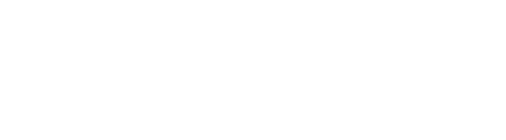

<p align="center">

</p>

[](https://app.netlify.com/sites/lucid-goldwasser-8d9866/deploys)


Hi folks❗

This is Lane Art Design. 🏝️ 

We decided to open our website source code for the Community. 💪

With this we pretend to:
1. Accept new ideas by anyone willing to participate
2. Be known by the Community

## Installation
Install [Visual Studio](https://code.visualstudio.com/Download), open a terminal, clone the repository by typing:
```shell
git clone https://github.com/Lane-Art-Design/LaneArtDesignResponsiveWeb.git
```
Make sure you have installed the [Git](https://git-scm.com/downloads) tool.

Then navigate to the new folder:
```shell
cd cyberfutureWebsite
```
and install all dependencies:
```shell
npm install
```
then type:
```shell
npm run dev
```
Make sure that you have already installed the [node.js](https://nodejs.org/es/).
Finally, open the browser at http://localhost:3000/ for visualizing the website. 


# Licence 

MIT License - Copyright (c) 2021 Lane Art Design


<br>

Thanks for your suport❗

Aaw-yeah❗


  <p/>
